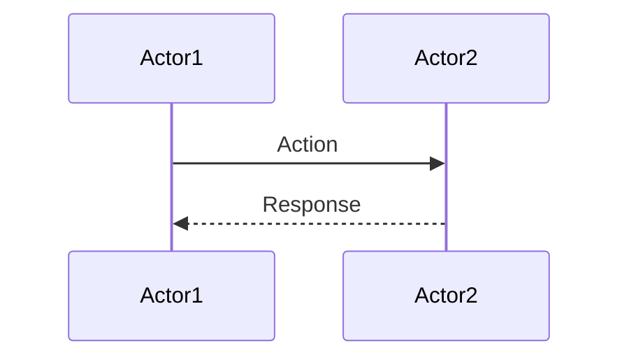
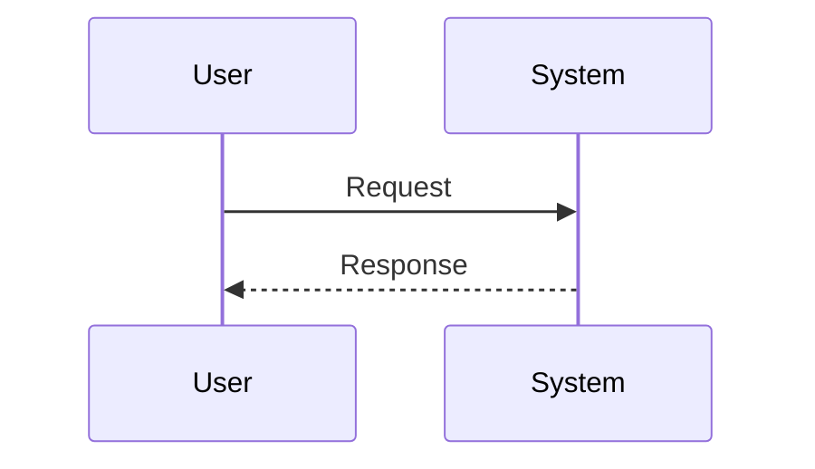
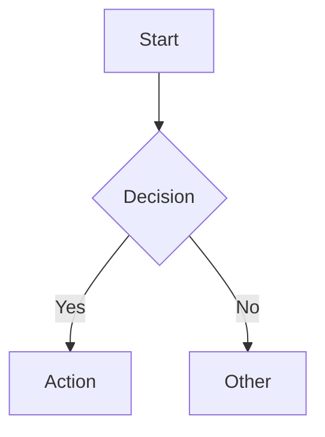
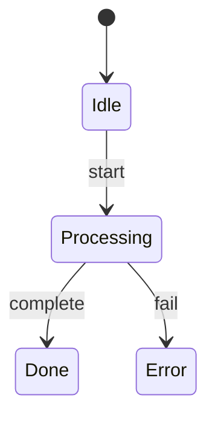

# Flow - Process Flow Documentation

Document workflows, sequences, and state machines with Mermaid diagrams.

## Usage

```
/flow [name]
/flow pr-review
/flow deployment
```

**Output:** `$PROJECT_ROOT/docs/flows/[name].md`

## Instructions

### Language Setting

> Check `LANGUAGE` in `docs/current.md`. If `th`, translate output per `references/language-guide.md`. See `references/bash-helpers.md` for detection snippet.

1. **Parse name** → kebab-case filename
2. **Ask user** about the flow:
   - What type? (process/sequence/state)
   - What actors/components are involved?
   - What are the main steps?
3. **Generate** flow document with Mermaid diagram
4. **Save** to `docs/flows/[name].md`

## Template

```markdown
# [Flow Name]

| Field | Value |
|-------|-------|
| Type | Process / Sequence / State |
| Actors | [list of actors] |
| Created | YYYY-MM-DD |

## Overview

> One sentence description of what this flow does.

## Diagram



## Steps

1. **Step 1**: Description
2. **Step 2**: Description
3. **Step 3**: Description

## Error Handling

| Error | Handling |
|-------|----------|
| [error case] | [how to handle] |

## Related

- [related flows or docs]
```

## Diagram Types

### Sequence Diagram


### Flowchart


### State Diagram


## Related Commands

| Command | Purpose |
|---------|---------|
| `/mem` | Capture insights about flows |
| `/flow` | Document flows (you are here) |
| `/pattern` | Document reusable patterns |
